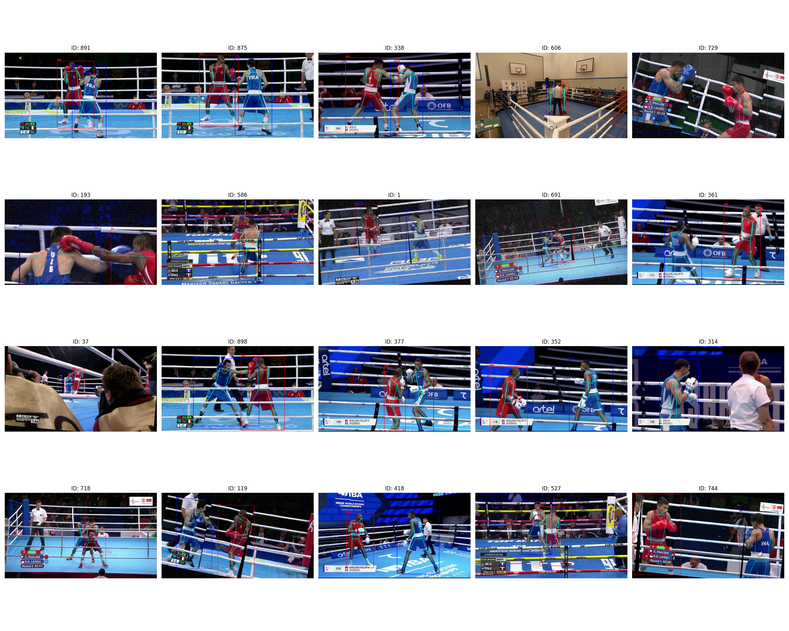

# 🥊 Boxer Pose Estimation & Analysis


A specialized computer vision pipeline for **Boxer Detection, Tracking, and 14-Point Pose Estimation**. This project leverages **YOLOv11** and a custom **Semi-Supervised Hybrid Training** strategy to achieve high performance on limited annotated data.

---

## 🎥 Demo

**Current performance using YOLOv11m-pose trained on 1,200 manually annotated frames:**

https://github.com/user-attachments/assets/85f23710-baa2-475a-8589-5e5fcc28c15b

> *Offline pose estimation with 14-keypoint skeleton tracking during boxing matches*

---

## 🚀 Key Features

* **Real-Time Performance:** Optimized for RTX 5060/3060 class hardware using **YOLOv11m-pose**
* **Custom Skeleton:** Estimates 14 specific keypoints (Nose, Neck, Shoulders, Elbows, Wrists, Hips, Knees, Ankles) crucial for boxing analysis
* **Occlusion Robustness:** Specifically tuned to handle close-contact clinches and rapid movements
* **Hybrid Semi-Supervised Learning:** Solves the "data scarcity" problem by combining small fully-annotated datasets with large bounding-box-only datasets
* **Semi-Supervised Hybrid Training:** distinct "Teacher-Student" pipeline using **ViTPose (Teacher)** to auto-annotate keypoints for **YOLOv11 (Student)** training.

---

## 🧠 Hybrid Training Pipeline (Teacher-Student)

To achieve high-accuracy pose estimation without thousands of hours of manual annotation, we implemented a **Semi-Supervised Teacher-Student Pipeline**.

### The Challenge: Data Imbalance
We faced a common computer vision hurdle:
1.  **Gold Dataset (~1,200 images):** High-quality, manually annotated **Bounding Boxes + Keypoints**.
2.  **Silver Dataset (~7,300 images):** Verified **Bounding Boxes only**, but missing skeleton data.

Training on the "Silver" dataset normally risks "unlearning" poses (because the loss function interprets missing keypoints as background). However, ignoring it wastes valuable detection data.

### The Solution: ViTPose Auto-Annotation
Instead of relying on weak self-training, we employed a **Teacher-Student** architecture to upgrade the "Silver" data into fully usable training samples.

**The Pipeline:**
1.  **Teacher Inference (ViTPose-Base):** We utilize a pre-trained **ViTPose-Base** (OpenMMLab) as the "Teacher". It takes our verified ground-truth bounding boxes and predicts high-precision 14-point skeletons.
2.  **Strict Fusion:** We merge the **Manual Bounding Boxes** (verified human logic) with the **Teacher's Keypoints** (model precision) to create a massive "Hybrid" dataset.
3.  **Student Training (YOLOv11):** The lightweight **YOLOv11m-pose** ("Student") is trained on this combined dataset of 8,500+ images. This allows the Student to learn the Teacher's high-fidelity pose accuracy while retaining YOLO's real-time inference speed (which ViTPose lacks).

**Generated Hybrid Samples:**

> *Sample batch from the Hybrid Dataset. Bounding boxes are manually verified (Red=Boxer 1, Blue=Boxer 2) to ensure correct ID tracking, while the internal skeletons are generated by the ViTPose Teacher.*

## 🛠️ Installation

We use `uv` for fast, reliable dependency management.

```bash
# 1. Clone the repository
git clone https://github.com/yourusername/Boxer-Pose-Estimation.git
cd Boxer-Pose-Estimation

# 2. Install PyTorch Nightly (Required for RTX 5060 / Blackwell / CUDA 12.8)
uv pip install --pre torch torchvision --index-url https://download.pytorch.org/whl/nightly/cu128

# Or install stable PyTorch (for most GPUs)
uv pip install torch torchvision

# 3. Install Project Dependencies
uv pip install -r requirements.txt
```

---

## 🏃 Usage

### 1. Interactive Menu (Recommended)
```bash
python src/main.py
```

### 2. Training (Hybrid Pipeline)
To train the model using the hybrid dataset configuration:

```bash
# Launch the main training dispatcher
python -m src.training.train --model yolov11m-pose --epochs 50 --data hybrid_train.yaml

# Or standard training on Gold dataset only
python -m src.training.train --model yolov11m-pose --epochs 50
```

### 3. Inference & Visualization
To run the model on a new video and generate the visualization shown in the demo:

```bash
# Run inference and generate COCO JSON
python -m src.training.inference --model yolov11m-pose --source data/test_video.mp4 --conf 0.5

# Visualize the result
python src/utils/visualize.py --annotations data/processed/annotations/test.json --video data/test_video.mp4
```

---

## 📂 Simplified Project Structure

```
Boxer-Pose-Estimation/
├── experiments/                         # Experiment notebooks
│   └── notebooks/
│       └── hybrid_training_pipeline.ipynb  # Pseudo-labeling workflow
│       └── vitpose_teacher_pipeline.ipynb  # vitpose workflow
│   └── plots/
│       └── hybrid_samples.png  # samples plot
├── src/
│   ├── main.py                          # CLI Entrypoint
│   ├── pipelines/
│   │   ├── yolo_pipeline.py             # ⭐ Main YOLO training/inference logic
│   │   ├── dino_pipeline.py             # [Archived] DINOv2 experiments
│   │   └── vitpose_pipeline.py          # [Archived] ViTPose experiments
│   ├── training/                        # Dispatchers for Train/Infer
│   ├── utils/
│   │   ├── visualize.py                 # Video overlay & rendering
│   │   ├── results_to_coco.py           # YOLO -> COCO conversion
│   │   └── coco_to_yolo_pose.py         # COCO -> YOLO conversion
│   ├── data_processing/                 # Dataset utilities
│   └── models/                          # Model architectures
├── data/
│   ├── pseudo_labels/                   # Generated Hybrid Dataset
│   └── processed/                       # Standardized Datasets
├── models/                              # Model weights (best.pt)
├── runs/                                # Training run outputs
└── requirements.txt
```

---

## 🗂️ Archive: Alternative Approaches

Before standardizing on YOLOv11, we explored several transformer-based architectures. These are currently deprecated but kept in the codebase for reference.

### RF-DETR (Receptive Field DETR)
**Hypothesis:** DETR's global attention would handle occlusion better than CNNs.

**Outcome:** Training was significantly slower and real-time inference was not achievable on target hardware without massive optimization.

### DINOv2 (Vision Transformer Backbone)
**Hypothesis:** Using DINOv2 features with a custom Deconv head for heatmap generation.

**Outcome:** While feature extraction was powerful, the custom head required significantly more data to converge compared to the pre-optimized YOLOv11 pose head.

---

## 📝 License

This project is licensed under the MIT License - see the [LICENSE](LICENSE) file for details.

---

## 🙏 Acknowledgments

- [Ultralytics YOLOv11](https://github.com/ultralytics/ultralytics) for the pose estimation framework
- CVAT team for annotation tools
- The boxing community for domain expertise